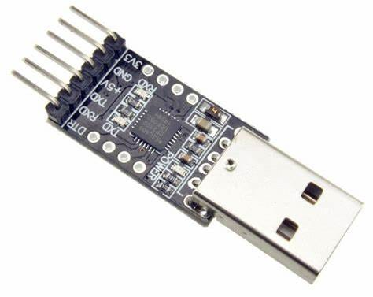
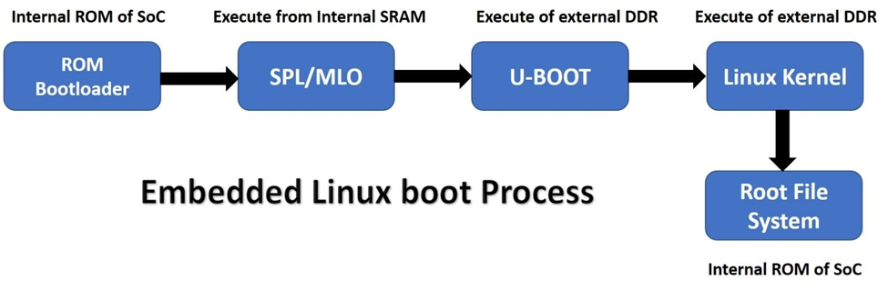

## Initiating the UART Shell
To begin interacting with an embedded device through a UART shell, the first step is to locate the UART pins on the device. You can achieve this by either using a multimeter or leveraging automated tools that simplify the identification process. Once you've found the UART pins, the next step is to establish a connection with a USB to TTL adapter.

## Connection Setup:
Use jumper wires to connect the identified UART pins to your USB to TTL device, following this configuration:
UART Pin → USB to TTL Pin
 RX (Receive) → TX (Transmit)
 TX (Transmit) → RX (Receive)
GND (Ground) → GND

With the connections in place, you'll need to identify the USB port to which your USB to TTL device is connected. On Windows, this port is usually labeled as `COM3` or similar, while on Linux-based systems like Ubuntu, it is referred to as `ttyUSB0` or `tty0`.
## Baud Rate Configuration:
The baud rate is crucial for establishing a successful connection. Common baud rates include 9600, 115200, or 57600. This rate can be predetermined by the device documentation, or you might need to experiment using frameworks or default settings.
Once everything is set, fire up a terminal program like PuTTY (Windows) or `screen` (Linux), and connect to the appropriate port. If successful, you'll have direct access to the device's console, allowing you to interact with the system at a low level.
## Understanding the Boot Sequence in Embedded Systems
Before diving into the bootloader analysis, it's important to understand how the boot sequence works in embedded systems. The boot process typically starts with a small amount of RAM and ROM within the chip, containing the Primary Program Loader. This loader's job is to load the U-Boot (a universal bootloader) from external ROM into RAM.

